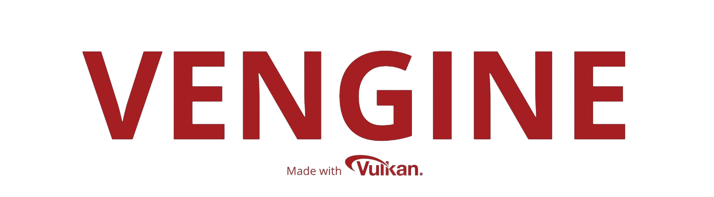

[](https://github.com/bobis33/VEngine/actions/workflows/VEngine.yml)

[](LICENSE)

**ACTUALLY WORKING ON IT!**

- [Description](#description)
- [Prerequisites](#prerequisites)
- [Usage](#usage)
- [Commit Norms](#commit-norms)
- [License](#license)
- [Acknowledgements](#acknowledgements)


## Description

Welcome to **VEngine**, a graphics engine developed with Vulkan.
This project aims to provide a robust foundation for game and application developers, focusing on the performance and flexibility offered by Vulkan.


## Prerequisites

- [CMake 3.27](https://cmake.org/)
- [GNU G++](https://gcc.gnu.org/)
- [C++20](https://en.cppreference.com/w/cpp/20)
- [Vulkan](https://www.vulkan.org/)
- [GLFW](https://www.glfw.org/)
- [GLM](https://github.com/g-truc/glm)
- [glslang](https://github.com/KhronosGroup/glslang)
- [assimp](https://www.assimp.org/)


## Usage

### Build

```bash
$> ./build.sh build
[...]
```
> if it doesn't work, try the following command:
```bash
$> ./build.sh clean && ./build.sh build
[...]
```

### Run

```bash
$> ./vengine
[...]
```


## Commit Norms

| Commit Type | Description                                                                                                               |
|:------------|:--------------------------------------------------------------------------------------------------------------------------|
| build       | Changes that affect the build system or external dependencies (npm, make, etc.)                                           |
| ci          | Changes related to integration files and scripts or configuration (Travis, Ansible, BrowserStack, etc.)                   |
| feat        | Addition of a new feature                                                                                                 |
| fix         | Bug fix                                                                                                                   |
| perf        | Performance improvements                                                                                                  |
| refactor    | Modification that neither adds a new feature nor improves performance                                                     |
| style       | Change that does not affect functionality or semantics (indentation, formatting, adding space, renaming a variable, etc.) |
| docs        | Writing or updating documentation                                                                                         |
| test        | Addition or modification of tests                                                                                         |


## License

This project is licensed under the MIT License - see the [LICENSE](LICENSE) file for details.


## Acknowledgements

Thanks to [Brendan Galea](https://github.com/blurrypiano/littleVulkanEngine).
